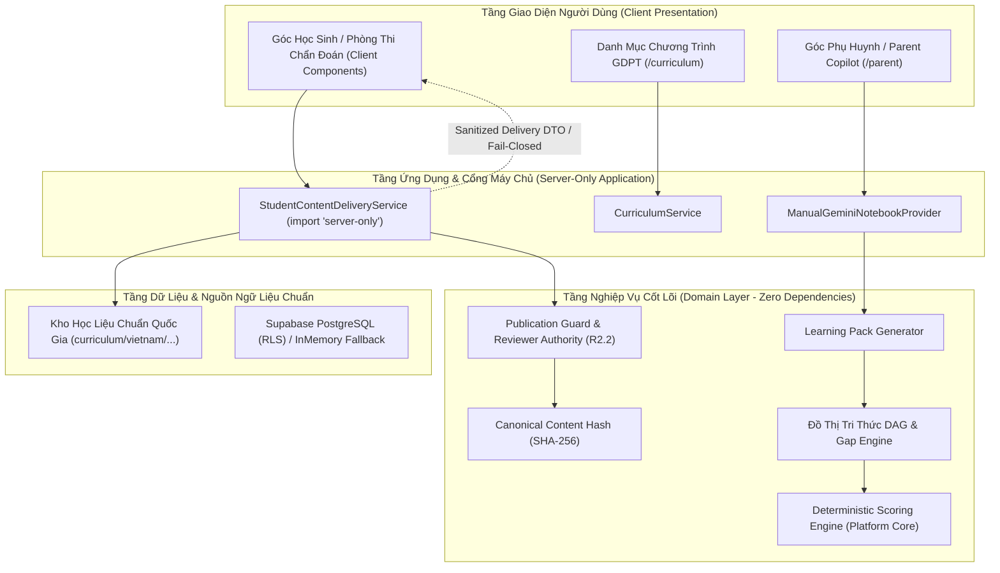

# Kiến Trúc Hệ Thống AI School (AI School System Architecture)

**Tài Liệu Thẩm Quyền Kiến Trúc:**
```text
AUTHORITATIVE CURRENT ARCHITECTURE
SUPERSEDES: Historical Generic Assessment Platform (v0.1 / Transitional V1/V2)
FROZEN BASELINE: R2.1 Source Provenance / R2.2 Publication Gate / R2.2.1 Server Delivery Boundary
```

Vui lòng tham khảo chi tiết tại: [docs/authority/AI_SCHOOL_CURRENT_AUTHORITY.md](docs/authority/AI_SCHOOL_CURRENT_AUTHORITY.md).  
Phạm vi sản phẩm: **Mầm non (3–6 tuổi)** theo Chương trình GDMN quốc gia và **Lớp 1–12** theo GDPT 2018 với thẩm quyền phân tầng riêng biệt.

---

## 1. Mô Hình Phân Tầng Sạch (Clean Architecture Overview)



---

## 2. Các Ranh Giới Nghiệp Vụ Cốt Lõi (Domain Boundaries)

### 2.1 Quản Lý Chương Trình & Đồ Thị Tri Thức (`src/domain/curriculum/`)
- **Đồ thị tri thức có hướng (DAG)**: Đại diện cho các đốt năng lực (`KnowledgeNode`) và liên kết tiên quyết (`PrerequisiteEdge`) chuẩn hóa theo Yêu cầu cần đạt (YCCĐ) của GDPT 2018.
- **Kiểm định đồ thị (`graph-validator.ts`)**: Tự động phát hiện chu trình (cycle detection via DFS) và tự lặp (self-loop), đảm bảo tính toàn vẹn toán học của đồ thị.

### 2.2 Tầng Thẩm Quyền Học Liệu (R2 Content Authority Layer: FROZEN) — `src/domain/content/`
- **Định dạng chuẩn hóa tất định (`canonical-json.ts`)**: Đảm bảo JSON serialize theo thứ tự khóa đồng nhất (`stableCanonicalJsonV1`).
- **Mã băm nội dung chuẩn (`canonical-content-hash.ts`)**: Tính toán SHA-256 trên nội dung sư phạm thực tế (loại bỏ siêu dữ liệu quy trình); bảo toàn thứ tự các mảng ngữ nghĩa.
- **Ủy quyền người thẩm định (`reviewer-registry.ts`)**: Cơ chế ủy quyền thẩm định chỉ đọc trong môi trường sản xuất (`productionReviewerAuthority`), ném ngoại lệ bảo mật `SECURITY_VIOLATION` nếu cố tình tiêm thẩm quyền giả mạo ngoài môi trường test.
- **Cổng phát hành duy nhất (`publication-guard.ts`)**:
  - `assertPublishedForStudent(item)`: Bắt buộc `itemMaturity` hợp lệ (`REVIEWED`, `PILOT`, `CALIBRATED`), kiểm tra độ tươi của mã băm (`contentHash === computedHash`) và chứng nhận thẩm định con người (`reviewAttestation`).
  - Từ chối ngay lập tức trạng thái `DRAFT` hoặc học liệu bị chỉnh sửa sau thẩm định (`REVIEW_ATTESTATION_STALE`).

### 2.3 Động Cơ Chẩn Đoán & Bồi Đắp Lỗ Hổng (`src/domain/diagnostic/`, `src/domain/remediation/`)
- **Động cơ đánh giá mắt xích (`engine.ts`)**: Đánh giá câu trả lời học sinh và phân loại trạng thái năng lực từng đốt (`SECURE`, `DEVELOPING`, `EMERGING`, `NOT_ASSESSED`).
- **Động cơ truy vết lỗ hổng gốc (`gap-engine.ts`)**: Truy vết ngược trên đồ thị DAG từ kỹ năng học sinh thất bại để xác định chính xác mắt xích nền tảng bị hổng.
- **Tạo gói bồi đắp kiến thức (`learning-pack.ts`)**: Đóng gói nội dung ôn tập trọng tâm và kế hoạch luyện tập; cô lập hoàn toàn không chứa mã lệnh hay prompt Generative AI dành cho học sinh.

### 2.4 Hạ Tầng Nền Tảng Tái Sử Dụng (`src/domain/assessment/`, `src/infrastructure/database/`)
- **Hệ thống tính điểm tất định tái sử dụng**: Kế thừa từ Platform Core, tính toán điểm số 100% bằng thuật toán máy chủ, không phụ thuộc AI.
- **Xác thực ẩn danh mật mã học (`src/infrastructure/auth/`)**: Sử dụng token ngẫu nhiên 256-bit lưu qua cookie HttpOnly an toàn.

---

## 3. Ranh Giới Giao Tiếp Máy Chủ & Khách Hàng (Server Delivery Boundary R2.2.1)

Học liệu DRAFT tuyệt đối không được phép lọt vào trình duyệt của học sinh:

```text
canonical repository files (items.json, fractions-addition.json, graphs)
       ↓
SERVER-ONLY loader (`import "server-only"`)
[StudentContentDeliveryService]
       ↓
publication guard (`assertPublishedForStudent` / `filterPublishedForStudent`)
       ↓
sanitized published delivery DTO (`DiagnosticDeliveryDto` / `LessonDeliveryDto`)
       ↓
Client Component (`Grade6FractionsDiagnosticFlow`)
```

- **Mô-đun Server-Only**: Chỉ các tệp có khai báo `import "server-only"` mới được phép nạp các tệp JSON ngân hàng câu hỏi hoặc bài học gốc.
- **Đóng phòng thi an toàn (Fail-Closed)**: Khi học liệu ở trạng thái DRAFT hoặc chưa có thẩm định hợp lệ, dịch vụ máy chủ trả về `status: "CONTENT_NOT_AVAILABLE"` và danh sách câu hỏi rỗng `[]`.
- **Rà soát mã nguồn client**: Các kiểm thử ranh giới đóng gói tự động quét toàn bộ bundle `.next/static/**` đảm bảo không chứa bất kỳ sentinel hoặc chuỗi văn bản DRAFT nào.

---

## 4. Ranh Giới AI Phụ Huynh (Parent Copilot Boundary)

- **Cô lập ngữ cảnh**: Prompt phụ huynh (`ManualGeminiNotebookProvider`) chỉ được khởi tạo và phục vụ tại tuyến đường phụ huynh `/parent`.
- **Ngữ liệu căn cứ**: Toàn bộ nội dung gợi ý phụ huynh phải căn cứ trực tiếp trên chuẩn YCCĐ Thông tư 32 và báo cáo lỗ hổng cụ thể của học sinh.
- **Bất biến quyền năng**: Parent Copilot không thể thay đổi dữ liệu điểm số, không can thiệp trạng thái làm chủ năng lực của học sinh.

---

## 5. Ma Trận Suy Giảm Hữu Ích (Graceful Degradation Matrix)

| Thành Phần Phụ Thuộc | Trạng Thái Ngoại Lệ | Hành Vi Của Nền Tảng |
| :--- | :--- | :--- |
| **Học liệu chưa qua thẩm định con người** | DRAFT hoặc thiếu review attestation | Tự động hiển thị màn hình chờ thẩm định `CONTENT_NOT_AVAILABLE`, không lộ câu hỏi. |
| **Đồ thị tri thức chưa thẩm duyệt** | SOURCE_LINKED / unreviewed | Giao diện hiển thị trạng thái chờ thẩm định, không tải dữ liệu đồ thị unreviewed. |
| **Supabase PostgreSQL** | Chưa cấu hình hoặc lỗi kết nối | Tự động chuyển sang `InMemoryAssessmentRepository` lưu trữ an toàn trong bộ nhớ. |
| **AI API Key (Parent Copilot)** | Chưa cấu hình key | Tự động chuyển sang chế độ Mock AI fallback với prompt mẫu chuẩn mực. |
