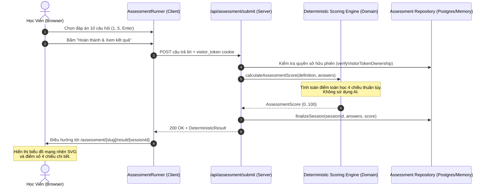
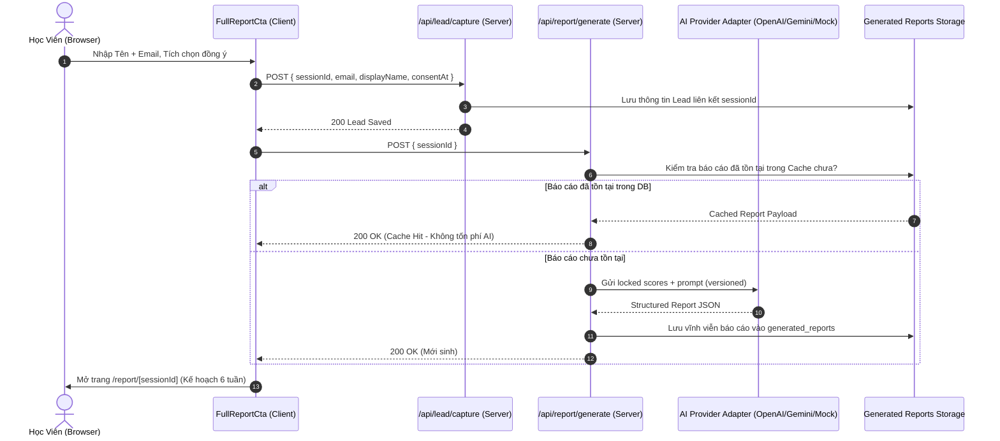

# Kiến Trúc Nền Tảng (Platform Architecture)

Tài liệu này định nghĩa toàn bộ kiến trúc phân tầng, luồng dữ liệu, ranh giới an toàn và các nguyên tắc thiết kế kỹ thuật của dự án **Assessment Studio**.

---

## 1. Mô Hình Phân Tầng Sạch (Clean Architecture Layers)

```mermaid
graph TD
    subgraph UI ["Giao Diện (UI / Presentation Layer)"]
        Pages["Next.js App Router (app/)"]
        Comp["React 19 Components (components/)"]
    end

    subgraph Application ["Tầng Ứng Dụng (Application Layer)"]
        RepoPort["AssessmentRepository Port"]
        AIPort["ReportGenerator Port"]
        AnalyticsPort["AnalyticsTracker Port"]
    end

    subgraph Domain ["Tầng Nghiệp Vụ Cốt Lõi (Domain Layer)"]
        ScoringEngine["Deterministic Scoring Engine"]
        ResultBands["Result Bands Definition"]
        AssessmentSchema["Assessment Zod Contracts"]
        ReportSchema["Structured Report Schema"]
        Referral["Referral Normalizer"]
    end

    subgraph Infrastructure ["Tầng Hạ Tầng (Infrastructure Layer)"]
        SupabaseRepo["Supabase PostgreSQL (RLS)"]
        MemRepo["In-Memory Safe Fallback"]
        AIAdapters["OpenAI / Gemini / Mock AI"]
        VisitorAuth["HttpOnly 256-bit Token Auth"]
        AnalyticsAdapters["FirstParty / PostHog Tracker"]
    end

    UI --> Application
    Application --> Domain
    Infrastructure ..|> Application
    Infrastructure --> Domain
```

### 1.1 Tầng Domain (`src/domain/`)
- **Nguyên tắc độc lập tuyệt đối**: Không phụ thuộc vào Next.js, React, Supabase hay bất kỳ nhà cung cấp AI nào.
- **Nghiệp vụ**:
  - `scoring.ts`: Động cơ tính điểm toán học thuần túy (`calculateAssessmentScore`), thực hiện chuẩn hóa khoảng min/max lý thuyết (0..100) theo từng chiều năng lực.
  - `result-bands.ts`: Phân loại 4 dải năng lực định tính (Khởi đầu, Đang phát triển, Vững vàng, Xuất sắc) dựa trên mốc điểm xác định.
  - `schema.ts`: Xác thực cấu trúc bài thi với Zod.
  - `referral.ts`: Chuẩn hóa và làm sạch mã giới thiệu URL.

### 1.2 Tầng Application (`src/application/`)
- Định nghĩa các cổng trừu tượng (Ports/Interfaces) mà tầng UI sử dụng để tương tác với thế giới bên ngoài:
  - `assessment-repository.ts`: Lưu trữ phiên, câu trả lời, lưu kết quả, gán người dùng, số liệu admin.
  - `report-generator.ts`: Hợp đồng sinh báo cáo chi tiết.
  - `analytics.ts`: Ghi nhận sự kiện phễu.

### 1.3 Tầng Infrastructure (`src/infrastructure/`)
- Triển khai cụ thể các Adapter:
  - `database/`: `SupabaseAssessmentRepository` kết nối PostgreSQL với RLS; tự động suy giảm về `InMemoryAssessmentRepository` nếu chưa có thông tin kết nối.
  - `ai/`: `OpenAILikeReportGenerator` và `MockReportGenerator` với bộ định tuyến `getReportGenerator()`.
  - `auth/`: `anonymous-visitor.ts` quản lý token ngẫu nhiên 256-bit; `admin-auth.ts` bảo vệ quyền quản trị viên phía server; `safe-redirect.ts` ngăn chặn Open Redirect.

### 1.4 Tầng UI / Presentation (`app/`, `components/`)
- Next.js 15 App Router tận dụng Server Components theo mặc định cho các trang tĩnh (Landing, Legal, Dashboard shell).
- Client Components (`"use client"`) chỉ đóng gói các tương tác giao diện cần thiết (Runner phím tắt, Form Lead, Biểu đồ SVG).

---

## 2. Luồng Dữ Liệu Thực Thi (Execution Request Flows)

### 2.1 Luồng Làm Bài Đánh Giá & Tính Điểm Toán Học



### 2.2 Luồng Thu Thập Lead & Sinh Báo Cáo AI Kèm Bộ Đệm



---

## 3. Ranh Giới An Toàn Dữ Liệu & Quyền Sở Hữu Ẩn Danh

1. **Mã Sở Hữu Ẩn Danh (Visitor Token)**:
   - Khi truy cập lần đầu, máy chủ cấp một chuỗi ngẫu nhiên an toàn 256-bit (`crypto.randomBytes(32).toString("hex")`) lưu vào cookie HttpOnly `assessment_visitor_token`.
   - Trên cơ sở dữ liệu, token chỉ được lưu dưới dạng băm **SHA-256** (`visitor_owner_hash`).
   - Mọi thao tác tải bài làm hoặc xem kết quả đều so sánh băm bằng thuật toán hằng số thời gian (`crypto.timingSafeEqual`) để loại trừ tấn công timing attack.
2. **Liên Kết Hồ Sơ Khi Đăng Nhập (Session Claiming)**:
   - Khi học viên đăng nhập qua Magic Link, hệ thống dùng token trong cookie hiện tại để gán `user_id` cho các phiên làm bài đã hoàn thành tương ứng.
   - Tuyệt đối không tự động gán toàn bộ phiên làm bài chỉ dựa vào địa chỉ email trùng khớp.

---

## 4. Ma Trận Suy Giảm Hữu Ích (Graceful Degradation Matrix)

| Thành Phần Phụ Thuộc | Trạng Thái Ngoại Lệ | Hành Vi Của Nền Tảng |
| :--- | :--- | :--- |
| **Supabase PostgreSQL** | Chưa cấu hình hoặc lỗi kết nối | Tự động chuyển sang `InMemoryAssessmentRepository`. Người dùng hoàn thành bài thi và xem kết quả bình thường. |
| **AI Provider API Key** | Chưa cấu hình (`AI_PROVIDER=mock` hoặc key rỗng) | Tự động chuyển sang `MockReportGenerator`, trả về bản kế hoạch hành động 6 tuần khuôn mẫu chuẩn xác mà không báo lỗi 500. |
| **PostHog Analytics** | Không có key | Adapter PostHog tự động `no-op` (không gửi mạng, không ném lỗi), hệ thống vẫn duy trì First-Party event logger tối giản. |
| **Mất kết nối mạng tạm thời** | Trình duyệt mất mạng hoặc tải lại | `local-session-store` khôi phục câu hỏi và lựa chọn đã lưu trong `localStorage`. |
