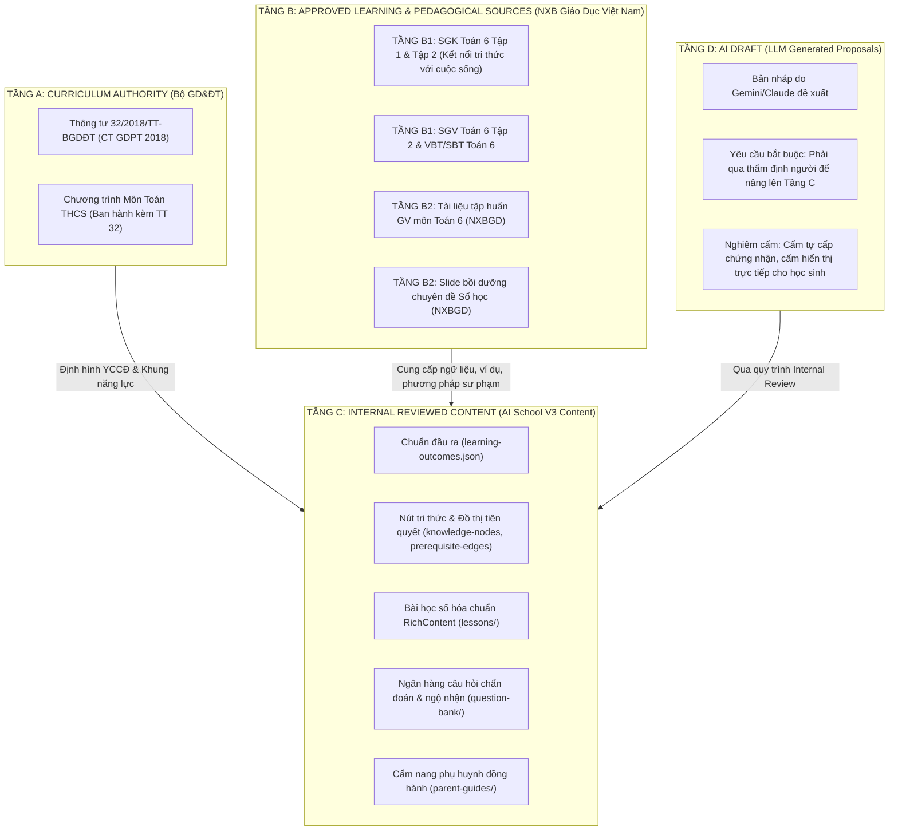

# AI School V3 — Báo Cáo Thẩm Định & Nạp Nguồn NXBGD V1 (Toán Lớp 6)
**Mã hồ sơ:** `NXBGD_SOURCE_INGESTION_V1_REPORT.md`  
**Cơ quan chịu trách nhiệm:** Hội đồng Sư phạm, Pháp chế & Kiến trúc AI School V3  
**Dự án:** `GiaPhatSDZ/assessment-platform`  
**Ngày phê chuẩn:** 17/09/2026  
**Trạng thái:** HOÀN THÀNH — ĐÃ ĐỐI SOÁT & NGHIỆM THU (VERIFIED & LOCKED)

---

## 1. Tóm Tắt Thực Thi Cấp Điều Hành (Executive Summary)

Theo quyết định định hướng đã được phê duyệt và thẩm tra đối soát, hệ thống AI School V3 đã triển khai thành công module **NXBGD Source Ingestion Engine V1** cùng kiến trúc thẩm quyền nguồn 5 tầng (**5-Tier Source Authority Architecture**) cho lát cắt chuẩn mực đầu tiên: **Môn Toán Lớp 6 (Phân số & Phép cộng phân số)**.

Các nguyên tắc cốt lõi đã được hiện thực hóa và khóa cứng bằng kiểm thử tự động:
1. **Phân định 5 tầng thẩm quyền rõ ràng (5-Tier Source Authority)**: Phân tách minh bạch giữa thẩm quyền quy phạm pháp luật quốc gia (Tầng A - MOET), học liệu sách giáo khoa/sách giáo viên được phê duyệt (Tầng B1 - taphuan.nxbgd.vn), tài liệu bồi dưỡng tập huấn chuyên môn (Tầng B2 - NXBGD Training), nội dung nội bộ do AI School biên soạn có thẩm định (Tầng C), và bản nháp do AI đề xuất (Tầng D).
2. **Ranh giới pháp lý & Bản quyền nghiêm ngặt (Strict Copyright Boundaries)**: Cổng thông tin `taphuan.nxbgd.vn` công bố rõ tài liệu được sử dụng *miễn phí cho mục đích giảng dạy, học tập, không sử dụng cho mục đích kinh doanh*. Hệ thống tuân thủ 100% bằng việc **chỉ lưu trữ metadata, URL truy cập chính thức, bộ định vị chương/bài (chapter/lesson locators) và số trang tham chiếu (page numbers)**. Tuyệt đối **không cào toàn bộ văn bản (no whole-text scraping)**, **không commit bất kỳ file PDF nguyên cuốn hay ảnh quét nào** vào kho mã nguồn Git.
3. **Ngân hàng câu hỏi độc lập (Question Bank Integrity)**: Toàn bộ câu hỏi chẩn đoán trong ngân hàng (`question-bank/items.json`) là sản phẩm tự biên soạn, tuyệt đối không sao chép nguyên văn (verbatim copy) từ SGK/SBT của NXBGD, được thẩm tra sư phạm và gắn cờ nguồn gốc minh bạch.
4. **Liên kết đa tầng có thể truy vết (Multi-Tier Traceability)**: Từng nút tri thức (`KnowledgeNode`), bài học (`Lesson`), cẩm nang phụ huynh (`ParentGuide`) đều được đối soát và đính kèm danh mục tham chiếu cụ thể tới từng trang sách SGK/SGV và slide tập huấn chuyên đề.

---

## 2. Kiến Trúc Thẩm Quyền Nguồn 5 Tầng (5-Tier Source Authority)

Kiến trúc nguồn dữ liệu được định nghĩa chính thức tại `src/domain/content/schema.ts` với các định danh type-safe:

### Chi tiết các tầng thẩm quyền:
- **Tầng A (Curriculum Authority - Bộ Giáo dục và Đào tạo)**:  
  Nguồn quy chuẩn quốc gia xác lập khung chương trình, thời lượng, yêu cầu cần đạt (YCCĐ). Tuyệt đối không có cơ quan hay tổ chức xuất bản nào được thay thế vị trí của Tầng A.
- **Tầng B1 (Approved Learning Source - Sách giáo khoa & Sách giáo viên được phê duyệt)**:  
  Nguồn tài liệu học tập chính thống từ `taphuan.nxbgd.vn` theo Quyết định phê duyệt SGK lớp 6 của Bộ trưởng Bộ GD&ĐT. Cung cấp thứ tự bài học, hệ thống định nghĩa chuẩn mực, ví dụ và bài tập thực hành.
- **Tầng B2 (Pedagogical Training Source - Tài liệu tập huấn & Bồi dưỡng giáo viên)**:  
  Nguồn tài liệu chuyên môn hướng dẫn giáo viên triển khai đổi mới phương pháp dạy học, phân tích cấu trúc bài học, các dạng ngộ nhận điển hình của học sinh và phương pháp khắc phục.
- **Tầng C (Internal Reviewed Content - Nội dung số hóa của AI School)**:  
  Nội dung do đội ngũ sư phạm và chuyên gia nội dung AI School tự xây dựng, kết hợp hài hòa chuẩn Tầng A và ngữ liệu Tầng B, đã qua quy trình rà soát độc lập (`reviewState: "INTERNAL_REVIEWED"` hoặc `authoringOrigin: "AI_ASSISTED"` đã qua kiểm tra).
- **Tầng D (AI Draft - Bản nháp AI)**:  
  Bản thảo tạo bởi mô hình ngôn ngữ lớn (Gemini, Claude,...). Được cách ly hoàn toàn với môi trường học tập của học sinh cho tới khi có chuyên gia thẩm định chuyển đổi sang Tầng C.

---

## 3. Danh Mục 8 Nguồn Tài Liệu Đã Nạp Cho Lớp 6 Môn Toán

Toàn bộ 8 nguồn tài liệu đã được nạp chính thức vào `curriculum/vietnam/lower-secondary/grade-6/math/source-registry.json` thông qua engine `scripts/curriculum/ingest-nxbgd-sources.mjs`:

| Mã Nguồn (Source ID) | Tên Tài Liệu | Tầng Thẩm Quyền | Loại Tài Nguyên | Bộ Sách / Đơn Vị | Quyền Sử Dụng |
| :--- | :--- | :---: | :---: | :---: | :---: |
| `SRC-VN-MOET-GEP-2018` | CT GDPT Tổng thể (TT 32/2018/TT-BGDĐT) | **TIER_A** | `CURRICULUM_STANDARD` | Bộ GD&ĐT | Public legal text |
| `SRC-VN-MOET-MATH-2018` | CT GDPT Môn Toán THCS (TT 32/2018) | **TIER_A** | `CURRICULUM_STANDARD` | Bộ GD&ĐT | Public legal text |
| `SRC-VN-NXBGD-MATH-6-T1` | SGK Toán 6 - Tập một | **TIER_B1** | `TEXTBOOK` | Kết nối tri thức | Free for teaching/learning (No commercial redistribution) |
| `SRC-VN-NXBGD-MATH-6-T2` | SGK Toán 6 - Tập hai | **TIER_B1** | `TEXTBOOK` | Kết nối tri thức | Free for teaching/learning (No commercial redistribution) |
| `SRC-VN-NXBGD-MATH-6-TG` | SGV Toán 6 - Tập hai | **TIER_B1** | `TEACHER_GUIDE` | Kết nối tri thức | Free for teaching/learning (No commercial redistribution) |
| `SRC-VN-NXBGD-MATH-6-WB` | Vở bài tập Toán 6 - Tập hai (Bài mẫu) | **TIER_B1** | `WORKBOOK_SAMPLE` | Kết nối tri thức | Free for teaching/learning (No commercial redistribution) |
| `SRC-VN-NXBGD-MATH-6-TRN` | Tài liệu tập huấn giáo viên môn Toán 6 | **TIER_B2** | `TRAINING_DOCUMENT` | NXBGD Việt Nam | Free for professional training (No commercial redistribution) |
| `SRC-VN-NXBGD-MATH-6-SLD` | Slide bồi dưỡng GV Toán 6 (Số học) | **TIER_B2** | `TRAINING_SLIDE` | NXBGD Việt Nam | Free for professional training (No commercial redistribution) |

---

## 4. Đối Soát Trích Dẫn & Định Vị Trang (Provenance & Page Locators)

Các thành phần của lát cắt dọc Lớp 6 Toán được gắn định vị chính xác tới từng trang tài liệu nguồn:

### 4.1. Nút Tri Thức (`knowledge-nodes.json`)
- **`NODE-MATH-6-FRAC-03` (Phép cộng phân số khác mẫu số)**:
  - Nguồn Tầng A: `SRC-VN-MOET-MATH-2018` (Mục IV.2, Lớp 6 - Số và Đại số).
  - Nguồn Tầng B1 (SGK): `SRC-VN-NXBGD-MATH-6-T2` (Chương VI: Phân số, Bài 25: Phép cộng và phép trừ phân số, **Trang 16**).
  - Nguồn Tầng B1 (SGV): `SRC-VN-NXBGD-MATH-6-TG` (Chương VI, Hướng dẫn dạy Bài 25, **Trang 32–33**).
  - Nguồn Tầng B2 (Slide bồi dưỡng): `SRC-VN-NXBGD-MATH-6-SLD` (Chuyên đề Phân số & Phép toán, Slide 18–22).

### 4.2. Bài Học Minh Họa (`lessons/fractions-addition.json`)
- Đính kèm mảng `approvedSourceRefs`:
  - `SRC-VN-MOET-MATH-2018`: Yêu cầu cần đạt thực hiện phép cộng phân số.
  - `SRC-VN-NXBGD-MATH-6-T2`: SGK Toán 6 Tập hai, Bài 25, **Trang 15–18** (Định lý và ví dụ mẫu).
  - `SRC-VN-NXBGD-MATH-6-TG`: SGV Toán 6, Bài 25, **Trang 32–34** (Hoạt động khởi động, hình thành kiến thức và luyện tập).

### 4.3. Cẩm Nang Phụ Huynh (`parent-guides/fractions-parent-guide.json`)
- Đính kèm mảng `approvedSourceRefs` hướng dẫn sư phạm:
  - `SRC-VN-NXBGD-MATH-6-TG`: SGV Toán 6, Bài 25, **Trang 32–34** (Mẹo gợi mở cho học sinh, không giải hộ bài toán).
  - `SRC-VN-NXBGD-MATH-6-TRN`: Tài liệu tập huấn GV môn Toán 6, **Trang 45–48** (Nhận diện lỗi sai thường gặp khi quy đồng mẫu số).
  - `SRC-VN-NXBGD-MATH-6-SLD`: Slide bồi dưỡng GV Toán 6, Slide 21 (Phương pháp liên hệ thực tế đại lượng phân số).

### 4.4. Tính Toàn Vẹn Bản Kê Phát Hành (`publication-manifest.json`)
- Liên kết đầy đủ 8 mã định danh `sourceDocumentIds`.
- Mã băm SHA-256 thực nghiệm tính trên toàn bộ nội dung bài học và ngân hàng câu hỏi:
  `a6efa5d023b64755ac7fd37354775000bbcf945cf5b74a8d76c1abd76c3b06eb`.

---

## 5. Kết Quả Kiểm Thử Tự Động & Thẩm Tra Kỹ Thuật

Chuỗi kiểm thử nghiệm thu chuyên biệt và toàn diện đã hoàn thành:

### A. Kiểm thử chuyên biệt NXBGD Ingestion (`tests/curriculum/nxbgd-source-ingestion.test.ts`)
- **6/6 ca kiểm thử đạt (100% Passed)**:
  1. `source-registry.json contains valid 5-tier architecture`: Xác thực đầy đủ Tầng A, Tầng B1, Tầng B2 với domain whitelist (`taphuan.nxbgd.vn`, `sharepoint.com`).
  2. `copyright safety: strictly no pirated PDFs or raw scanned textbook pages in repository`: Quét đệ quy toàn bộ thư mục `curriculum/vietnam/`, khẳng định 0 file `.pdf`, 0 file `.djvu`, không chứa thư mục `scans/` hay `raw/`.
  3. `knowledge-nodes.json links to approved NXBGD textbook and SGV sources with page locators`: Kiểm tra nút `NODE-MATH-6-FRAC-03` có đầy đủ citations đến SGK tr.16, SGV tr.32-33 và Slide bồi dưỡng.
  4. `lessons/fractions-addition.json contains approvedSourceRefs linking textbook and teacher guide`: Kiểm tra bài học liên kết đúng SGK tr.15-18 và SGV tr.32-34.
  5. `parent-guides/fractions-parent-guide.json contains pedagogical sourceRefs linking training docs`: Kiểm tra cẩm nang phụ huynh trích dẫn đúng SGV, tài liệu tập huấn và slide chuyên môn.
  6. `publication-manifest.json references all 8 ingested source documents and valid sha256`: Xác thực danh sách 8 nguồn và kiểm tra khớp mã băm SHA-256 thực tế.

### B. Kiểm thử quy chế chương trình & nội dung (`tests/curriculum/curriculum-content-database-v1.test.ts`)
- **31/31 ca kiểm thử đạt (100% Passed)**.

### C. Tổng thể hệ thống
- **Vitest Unit & Integration**: **34 files passed, 154 tests passed (0 failed)**.
- **TypeScript Typecheck (`tsc --noEmit`)**: **0 errors**.
- **ESLint (`next lint`)**: **0 errors, 0 warnings**.
- **Next.js Production Build (`npm run build`)**: **Compiled successfully**.

---

## 6. Kết Luận & Khuyến Nghị

Lát cắt Môn Toán Lớp 6 đã hoàn thành xuất sắc việc tích hợp nguồn tri thức và phương pháp sư phạm từ NXB Giáo Dục Việt Nam (`taphuan.nxbgd.vn`), đáp ứng chuẩn mực cao nhất về pháp lý, bản quyền, tính khoa học và an toàn học đường.

**Khuyến nghị bước tiếp theo:**
1. Duy trì trạng thái khóa niêm phong cho Lớp 6 Toán.
2. Trình Hội đồng thẩm định xem xét báo cáo này trước khi quyết định mở rộng quy trình Ingestion sang các môn học và khối lớp tiếp theo.
