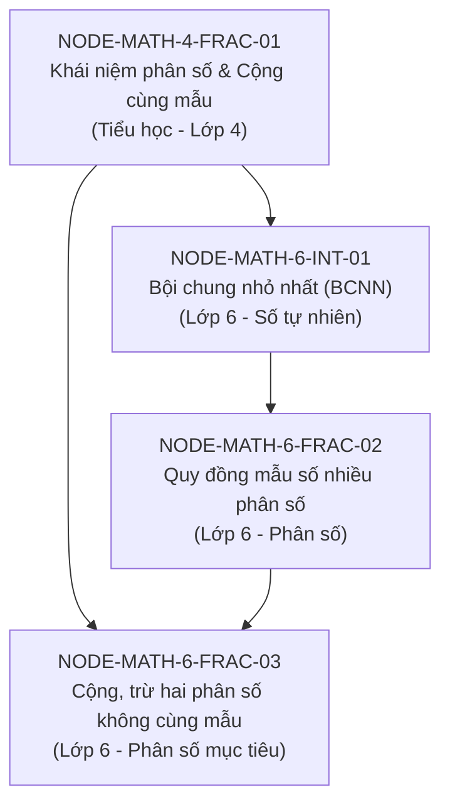

# AI School V3 — Vertical Slice Selection

**Status:** APPROVED research selection  
**Date:** 2026-09-17  
**Authority:** Thông tư số 32/2018/TT-BGDĐT ngày 26/12/2018 (Chương trình môn Toán)  
**Topic:** Toán học Lớp 6 — Phân số: Phép cộng và phép trừ hai phân số khác mẫu số

---

## 1. Selected Topic and Node Chain

### Target Primary Node (Nút mục tiêu đánh giá)
* **Node ID:** `NODE-MATH-6-FRAC-03`
* **Mã định danh:** `MATH.G6.FRAC.ADD_SUB_UNLIKE`
* **Tên hiển thị:** Cộng và trừ hai phân số không cùng mẫu số
* **Cấp học / Lớp:** Cấp THCS — Lớp 6
* **Mạch kiến thức:** Số và Đại số
* **Yêu cầu cần đạt gốc (Trích TT 32/2018/TT-BGDĐT, trang 48):**
  > "Thực hiện được các phép tính cộng, trừ, nhân, chia đối với phân số."
* **Mô tả hành vi học sinh:** Học sinh quy đồng mẫu các phân số và thực hiện phép cộng, trừ các phân số có cùng mẫu sau quy đồng.

---

## 2. Prerequisite Chain (Chuỗi kiến thức tiên quyết có căn cứ)

Lỗ hổng khi cộng phân số khác mẫu thường không bắt nguồn từ phép cộng, mà xuất phát từ chuỗi tiền đề sau:

### Chi tiết các nút tiên quyết:

1. **`NODE-MATH-6-FRAC-02` (Quy đồng mẫu số nhiều phân số)**
   * **Căn cứ:** TT 32/2018/TT-BGDĐT: *"Vận dụng được tính chất cơ bản của phân số trong việc quy đồng mẫu số nhiều phân số."*
   * **Mối quan hệ:** `REQUIRED` (Bắt buộc). Muốn cộng hai phân số khác mẫu số, bắt buộc phải đưa chúng về cùng một mẫu chung dương.

2. **`NODE-MATH-6-INT-01` (Tìm Bội chung nhỏ nhất - BCNN của hai số)**
   * **Căn cứ:** TT 32/2018/TT-BGDĐT: *"Tìm được ước chung lớn nhất, bội chung nhỏ nhất của hai hoặc ba số tự nhiên; vận dụng được trong việc quy đồng mẫu số các phân số."*
   * **Mối quan hệ:** `REQUIRED` (Bắt buộc). Kỹ năng tìm mẫu số chung nhỏ nhất dựa trực tiếp vào thuật toán phân tích ra thừa số nguyên tố để tìm BCNN.

3. **`NODE-MATH-4-FRAC-01` (Cộng hai phân số cùng mẫu số - Nền tảng Tiểu học)**
   * **Căn cứ:** TT 32/2018/TT-BGDĐT (Chương trình Toán Tiểu học - Lớp 4): *"Thực hiện được phép cộng, phép trừ hai phân số có cùng mẫu số."*
   * **Mối quan hệ:** `REQUIRED` (Bắt buộc). Bản chất sau khi quy đồng là đưa về phép tính cộng tử giữ nguyên mẫu.

---

## 3. Lý Do Lựa Chọn Lát Cắt Này (Selection Criteria Verification)

1. **Chuẩn nguồn 100% (Strict Source Provenance):** Toàn bộ câu từ yêu cầu cần đạt được trích lục chính xác từ văn bản quy phạm pháp luật Thông tư 32/2018/TT-BGDĐT, không qua bất kỳ lớp tóm tắt của AI nào.
2. **Khách quan và xác định bằng toán học (Deterministic Assessment):** Câu hỏi trắc nghiệm và điền đáp số có đáp án chuẩn tuyệt đối, có các phương án nhiễu (distractors) tương ứng chính xác với các ngộ nhận kinh điển của học sinh.
3. **Phát hiện lỗ hổng có bằng chứng thực chất (Evidence-backed Misconceptions):**
   * *Ngộ nhận 1:* Cộng tử với tử, mẫu với mẫu $\frac{a}{b} + \frac{c}{d} = \frac{a+c}{b+d}$.
   * *Ngộ nhận 2:* Nhân tử mà quên nhân mẫu, hoặc quy đồng sai BCNN.
4. **Quy mô vừa vặn để thẩm định độc lập:** Chuỗi gồm 4 nút tri thức, 3 cạnh tiên quyết, 12 câu hỏi chẩn đoán và kiểm tra lại (re-test), đủ ngắn gọn để kiểm thử toàn diện và đủ sâu sắc để chứng minh năng lực chẩn đoán.
